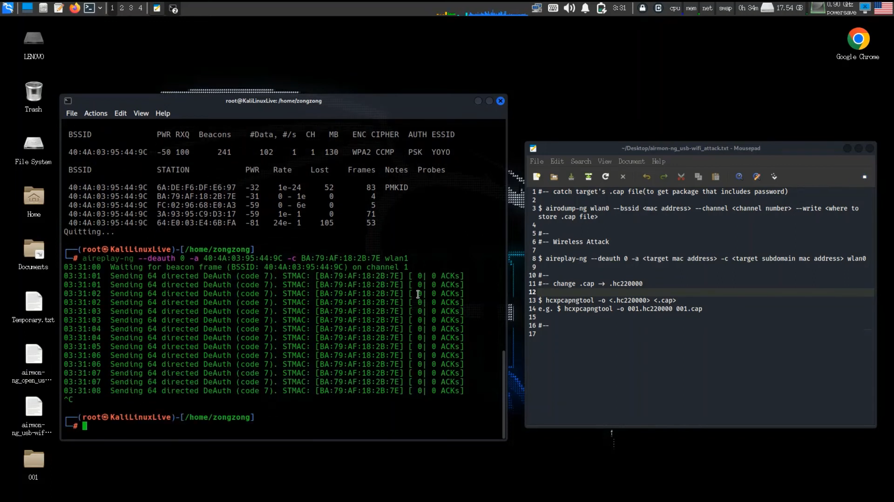

# 使用 Python 製作嗅探器實現對於 WiFi 的解除認證攻擊
# Python WiFi Deauthentication Attack by using Sniffer

基於 Kali Linux 使用 Python 配合 scapy 製作的自動攻擊腳本，目的是網路安全。

> 2024/05/06 啟用維護，參見[日誌](#日誌)。

- #### 範例圖片
<div align = "center"></div>

---

## 目錄
- [目錄](#目錄)
- [開發環境](#開發環境)
- [如何執行](#如何執行)
- [版本差異](#版本差異)
- [日誌](#日誌)
- [貢獻](#貢獻)
- [著作權](#著作權)

---

## 開發環境

- Kali Linux 2022.4
- kate
- `Python 3.7.0`

---

## 如何執行

> 預設 ***Kali Linux 2022.4*** 作業系統  

步驟 一：使用 USB 外接網卡，名稱可能會是 **wlan1** 之類的。
```bash
iwconfig
```

步驟 二：啟動腳本

- 方法一：直接點兩下執行 `deauth_attack.py`
>
- 方法二：照著 `deauth_attack.py` 提示輸入。

```bash
cd Python-wifi-deauthentication-attack-with-sniffers
```
```bash
python deauth_attack.py
```
> 也可以用 airmon-ng 自己先玩玩看，或是用 airmon-ng 做攻擊腳本（比較簡單）。

---

## 版本差異

| 版本 | 描述 |
| :--: | ---- |
| v1.0 | 現階段已完成。 |

---

## 日誌

| 時間 | 事件 |
| :--: | ---- |
| 2024/05/06 | 資料救援回復 **2022** 編輯紀錄，重新開始維護！ |

---

## 貢獻

獨立開發。

---

## 著作權

此專案受到 [GPL-3.0](https://www.gnu.org/licenses/gpl-3.0.zh-tw.html) 保障。  
Copyright © 2022-2024 zong zong ( zongzong0408 )
